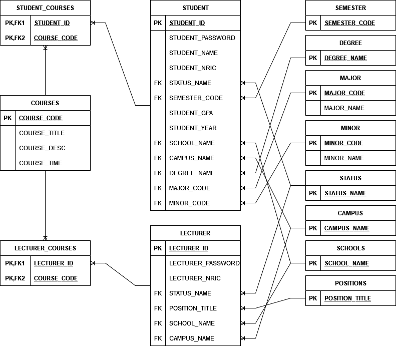

# Student Course Registration System

## Dependencies
- JavaFX
- JFoenix
- ITextPDF

## Database
- Oracle sql developer 11g
### ERD
- 
- The SQL script for creating the tables can be found in `CAT201project.sql`
### Data
- All of the data will be moved into excel files before migration.
- This makes it so it is easy for users to set up their DBs.
- Simply go into the tables in your sql developer 11g and import the data in.

## Demo
https://user-images.githubusercontent.com/60863955/153826648-3d2dcf6b-5f61-4cc3-999f-c417dce77828.mp4

## References
1. [JavaFX Layout - How to work with containers in the JavaFX GUI](https://www.youtube.com/playlist?list=PLS2jiMcL838K5tGWsjrXuTL-f3tRj_prE)
2. [Gradient Generator](https://mycolor.space/gradient?ori=to+right+top&hex=%233C047C&hex2=%23EB7E31&sub=1)
3. [Install JFoenix in SceneBuilder](https://www.youtube.com/watch?v=Di9f_eP_x9I)
4. [Flaticon Icons](https://www.flaticon.com/free-icons)
5. [Scroll Pane](https://docs.oracle.com/javafx/2/ui_controls/scrollpane.htm)
